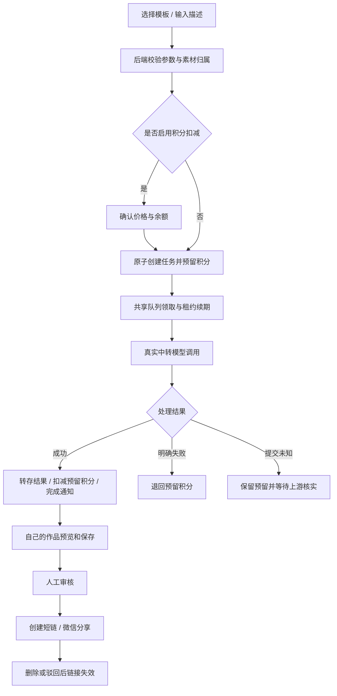
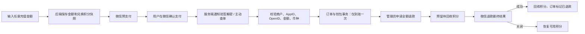

# 报价单业务流程

界面沿用 `docs/design/doubo.pen` 的深色灰绿小程序风格，以及流光管理端的表单和目录结构。新增页面源代码分别位于 `miniprogram/pages/` 和 `web/src/pages/`。

```mermaid
flowchart TD
  A[选择模板 / 输入描述] --> B[后端校验参数与素材归属]
  B --> C{是否启用积分扣减}
  C -->|是| D[确认价格与余额]
  D --> E[原子创建任务并预留积分]
  C -->|否| E
  E --> F[共享队列领取与租约续期]
  F --> G[真实中转模型调用]
  G --> H{处理结果}
  H -->|成功| I[转存结果 / 扣减预留积分 / 完成通知]
  H -->|明确失败| J[退回预留积分]
  H -->|提交未知| K[保留预留并等待上游核实]
  I --> L[自己的作品预览和保存]
  L --> M[人工审核]
  M --> N[创建短链 / 微信分享]
  N --> O[删除或驳回后链接失效]
```

```mermaid
flowchart LR
  A[输入任意充值金额] --> B[后端保存金额和兑换积分快照]
  B --> C[微信预支付]
  C --> D[用户在微信确认支付]
  D --> E[服务端通知验签解密 / 主动查单]
  E --> F[校验商户、AppID、OpenID、金额、币种]
  F --> G[订单与钱包事务：仅到账一次]
  G --> H[管理员申请全额退款]
  H --> I[预留待回收积分]
  I --> J[微信退款最终结果]
  J -->|成功| K[回收积分，订单标记已退款]
  J -->|关闭| L[恢复可用积分]
```

小程序保留混剪界面，混剪生成暂未开放；本地素材分析、音视频合成与字幕渲染代码已按新需求移除。
